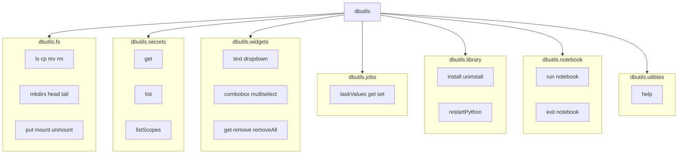

What utilities are for (business purpose)
Utilities exist because not every engineer wants to click through the GUI, and not every task should be done through the GUI.

So Databricks provides command‑based utilities (dbutils) that let you perform the same actions programmatically, with more control, automation, and repeatability.

🌟 One‑sentence definition
Utilities allow you to perform GUI‑based actions using code, so your workflows become automated, repeatable, and production‑ready.

🧠 Why this matters (business value)

1. Automation
GUI actions cannot be automated.
Utilities can be placed inside ETL pipelines, jobs, and workflows.

2. Repeatability
Clicking is inconsistent.
Code is consistent.

3. Scalability
A GUI works for one file.
Utilities work for millions.

4. DevOps & CI/CD
GUI actions cannot be version‑controlled.
Utilities can be stored in Git and deployed.

5. Speed
Engineers work faster with commands than with menus.

6. Debugging
Utilities let you inspect storage, secrets, and parameters inside the notebook, without switching tools.

🧱 Two‑word logic
GUI → Manual  
Utilities → Automated

🔧 Examples of GUI vs Utility
1. File System
GUI:
Click through ADLS → Containers → Browse → Files

Utility:

```Code
dbutils.fs.ls("abfss://demo@storage.dfs.core.windows.net/")
```
2. Secrets
GUI:
Azure Portal → Key Vault → Secrets → Copy

Utility:

```Code
dbutils.secrets.get("scope", "key")
```
3. Widgets
GUI:
No GUI equivalent — only utilities can create parameters.

Utility:

Code
dbutils.widgets.dropdown("year", "2024", ["2023","2024"])
📌 Your sentence rewritten in architect‑grade clarity
Utilities exist so that engineers can perform tasks normally done through the GUI using code instead. This makes workflows automated, repeatable, scalable, and suitable for production pipelines.


```text
===============================================================
                 DATABRICKS DBUTILS — ECOSYSTEM MAP
===============================================================

                               ┌──────────────────────┐
                               │      dbutils         │
                               └──────────┬───────────┘
                                          │
     ┌────────────────────────────────────┼────────────────────────────────────┐
     │                                    │                                    │

┌──────────────┐                 ┌────────────────┐                 ┌────────────────┐
│ dbutils.fs   │                 │ dbutils.secrets│                 │ dbutils.widgets│
└───────┬──────┘                 └─────────┬──────┘                 └────────┬───────┘
        │                                  │                                 │
        │                                  │                                 │
 File operations                     Secret scopes & keys                 Notebook UI controls
 (DBFS / ADLS / S3)                  (secure credential mgmt)             (parameters, dropdowns)

        │                                  │                                    │
        ▼                                  ▼                                    ▼

 ls, cp, mv, rm,                     get, list, listScopes             text, dropdown,
 mkdirs, head, tail,                                                     combobox, multiselect,
 put, mount, unmount                                                     get, remove, removeAll


     ┌────────────────────────────────────┼────────────────────────────────────┐
     │                                    │                                    │

┌──────────────┐                 ┌────────────────┐                 ┌──────────────────┐
│ dbutils.jobs │                 │ dbutils.library│                 │ dbutils.notebook │
└───────┬──────┘                 └─────────┬──────┘                 └─────────┬────────┘
        │                                  │                                  │
        │                                  │                                  │
 Workflow task values               Install/uninstall libs               Run/exit notebooks
 (job orchestration)                (cluster-scoped)                     (pipeline chaining)

        │                                    │                                    │
        ▼                                    ▼                                    ▼

 taskValues.get/set                install, uninstall,                  run(path, args),
                                   restartPython                        exit(value)


                               ┌──────────────────────┐
                               │ dbutils.utilities    │
                               └──────────┬───────────┘
                                          │
                                          ▼
                                       help()

===============================================================
```
Command to find all the utilities in Data Bricks:

UNIVERSAL COMMAND: Display all utilities:

```code
dbutils.help()
```

Getting Help on single utility:

```code
dbutils.<utility name>.help()
```


