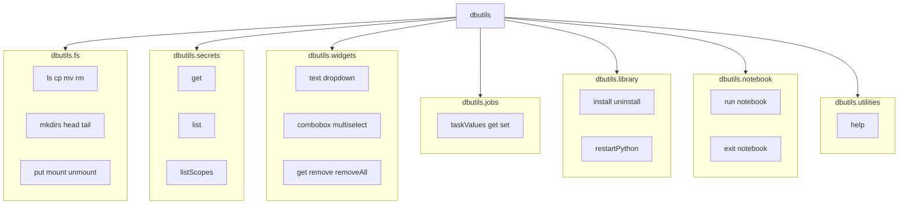

```text
===============================================================
                 DATABRICKS DBUTILS — ECOSYSTEM MAP
===============================================================

                               ┌──────────────────────┐
                               │      dbutils         │
                               └──────────┬───────────┘
                                          │
     ┌────────────────────────────────────┼────────────────────────────────────┐
     │                                    │                                    │

┌──────────────┐                 ┌────────────────┐                 ┌────────────────┐
│ dbutils.fs   │                 │ dbutils.secrets│                 │ dbutils.widgets│
└───────┬──────┘                 └─────────┬──────┘                 └────────┬───────┘
        │                                  │                                 │
        │                                  │                                 │
 File operations                     Secret scopes & keys                 Notebook UI controls
 (DBFS / ADLS / S3)                  (secure credential mgmt)             (parameters, dropdowns)

        │                                  │                                    │
        ▼                                  ▼                                    ▼

 ls, cp, mv, rm,                     get, list, listScopes             text, dropdown,
 mkdirs, head, tail,                                                     combobox, multiselect,
 put, mount, unmount                                                     get, remove, removeAll


     ┌────────────────────────────────────┼────────────────────────────────────┐
     │                                    │                                    │

┌──────────────┐                 ┌────────────────┐                 ┌──────────────────┐
│ dbutils.jobs │                 │ dbutils.library│                 │ dbutils.notebook │
└───────┬──────┘                 └─────────┬──────┘                 └─────────┬────────┘
        │                                  │                                  │
        │                                  │                                  │
 Workflow task values               Install/uninstall libs               Run/exit notebooks
 (job orchestration)                (cluster-scoped)                     (pipeline chaining)

        │                                    │                                    │
        ▼                                    ▼                                    ▼

 taskValues.get/set                install, uninstall,                  run(path, args),
                                   restartPython                        exit(value)


                               ┌──────────────────────┐
                               │ dbutils.utilities    │
                               └──────────┬───────────┘
                                          │
                                          ▼
                                       help()

===============================================================
```


