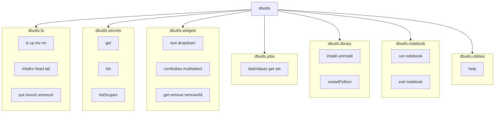

```mermaid
[36m===============================================================[0m
[36m                 DATABRICKS DBUTILS — ECOSYSTEM MAP[0m
[36m===============================================================[0m

                               [36m┌──────────────────────┐[0m
                               [36m│      dbutils         │[0m
                               [36m└──────────┬───────────┘[0m
                                          [34m│[0m
     [34m┌────────────────────────────────┼────────────────────────────────┐[0m
     [34m│                                │                                │[0m

[32m┌──────────────┐[0m              [32m┌────────────────┐[0m              [32m┌────────────────┐[0m
[32m│   dbutils.fs │[0m              [32m│ dbutils.secrets │[0m              [32m│ dbutils.widgets │[0m
[32m└───────┬──────┘[0m              [32m└─────────┬────────┘[0m              [32m└────────┬───────┘[0m
          [34m│[0m                                [34m│[0m                              [34m│[0m
          [34m│[0m                                [34m│[0m                              [34m│[0m
 [33mFile operations[0m                 [33mSecret scopes & keys[0m          [33mNotebook UI controls[0m
 [33m(DBFS / ADLS / S3)[0m              [33m(secure credential mgmt)[0m      [33m(parameters, dropdowns)[0m

          [34m│[0m                                [34m│[0m                              [34m│[0m
          [34m▼[0m                                [34m▼[0m                              [34m▼[0m

 [33mls, cp, mv, rm,[0m                 [33mget, list, listScopes[0m          [33mtext, dropdown,[0m
 [33mmkdirs, head, tail,[0m                                                [33mcombobox, multiselect,[0m
 [33mput, mount, unmount[0m                                                [33mget, remove, removeAll[0m


     [34m┌────────────────────────────────┼────────────────────────────────┐[0m
     [34m│                                │                                │[0m

[32m┌──────────────┐[0m              [32m┌────────────────┐[0m              [32m┌──────────────────┐[0m
[32m│ dbutils.jobs │[0m              [32m│ dbutils.library │[0m              [32m│ dbutils.notebook │[0m
[32m└───────┬──────┘[0m              [32m└─────────┬────────┘[0m              [32m└─────────┬────────┘[0m
          [34m│[0m                                [34m│[0m                              [34m│[0m
          [34m│[0m                                [34m│[0m                              [34m│[0m
 [33mWorkflow task values[0m          [33mInstall/uninstall libs[0m         [33mRun/exit notebooks[0m
 [33m(job orchestration)[0m           [33m(cluster-scoped)[0m               [33m(pipeline chaining)[0m

          [34m│[0m                                [34m│[0m                              [34m│[0m
          [34m▼[0m                                [34m▼[0m                              [34m▼[0m

 [33mtaskValues.get/set[0m            [33minstall, uninstall,[0m            [33mrun(path, args),[0m
                                     [33mrestartPython[0m                    [33mexit(value)[0m


                               [36m┌──────────────────────┐[0m
                               [36m│ dbutils.utilities    │[0m
                               [36m└──────────┬───────────┘[0m
                                          [34m│[0m
                                          [34m▼[0m
                                       [33mhelp()[0m
```

[36m===============================================================[0m


